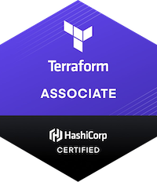

# Terraform Study Guide

Study Guide for the Terraform Associate Certification 2022

## Objectives

- [✅] 1. [Infrastructure as Code (IaC) Concepts](/Objective%201%20&%202/Iac.md)
- [✅] 2. [Terraform Purpose (vs other IaC)](/Objective%201%20&%202/Iac.md)
- [❌] 3. [Terraform Basics](/Objective%203/terraform-basics.md)
- [❌] 4. [Terraform CLI (outside of core workflow)](/Objective%204/terraform-cli.md)
- [❌] 5. [Terraform Modules](/Objective%205/modules.md)
- [❌] 6. [Terraform Workflow](/Objective%206/workflow.md)
- [❌] 7. [Implement, Maintain, and Manage State](/Objective%207/manage-state.md)
- [❌] 8. [Read, Generate, and Modify Configurations](/Objective%208/hcl-features.md)
- [✅] 9. [Terraform Cloud and Enterprise](/Objective%209/cloud-and-enterprise.md)

## Hashicorp Resources

- The exam will be on Terraform 0.12.0 and higher.
- [Official Study Guide](https://learn.hashicorp.com/tutorials/terraform/associate-study)
- [Sample Questions](/Sample%20Questions%20/Question-Answer.md)
- [Exam Review](https://learn.hashicorp.com/terraform/certification/terraform-associate-review)

## Additional Resources
- [Lab Tutorials](https://learn.hashicorp.com/tutorials/terraform/infrastructure-as-code?in=terraform/aws-get-started)
- [Terraform feature pdf](/tf-feature-table.pdf)
- [Terraform Registry - find modules for deploying common infra](https://registry.terraform.io/)